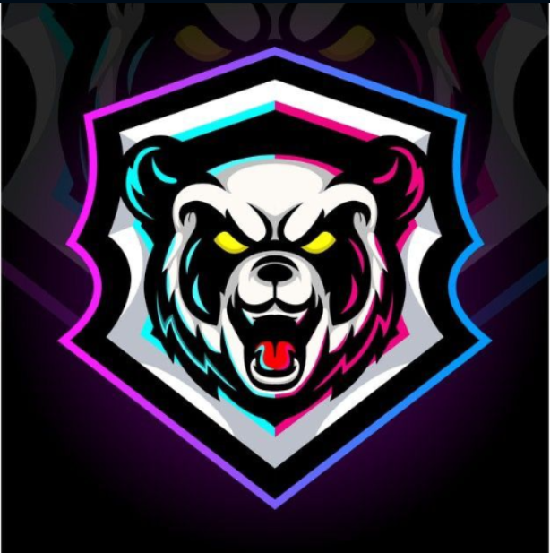

# ⚠️ PROPIEDAD INTELECTUAL PROTEGIDA - NO OPEN SOURCE ⚠️

**Copyright © 2026 D3B1A2C4F5E67890. Todos los derechos reservados.**

**Este proyecto NO es de código abierto. Está protegido por licencia restrictiva.**
**Cualquier uso no autorizado será reportado mediante DMCA y acciones legales.**

# 🎮 Serakdep MS Clan – Sitio Web Oficial

Bienvenido al sitio web oficial del clan **Serakdep MS**, una comunidad de Roblox dedicada al gaming organizado, respetuoso y divertido.

## 🔒 ESTATUS LEGAL

**PROYECTO PRIVADO CON LICENCIA RESTRICTIVA**
- 🔐 **Propiedad intelectual:** D3B1A2C4F5E67890
- 🌐 **URL oficial:** https://serakdepms.github.io/Serakdep-MS-Clan-Official/
- 📜 **Licencia:** Propietaria - Todos los derechos reservados
- 📅 **Última actualización:** 26 de enero de 2026

## 📋 TÉRMINOS DE USO

### ✅ **PERMITIDO:**
- Ver el sitio web en modo de solo lectura
- Reportar errores mediante Issues de GitHub
- Sugerir mejoras mediante Discussions
- Usar el formulario de inscripción como usuario final

### ❌ **ESTRICTAMENTE PROHIBIDO:**
- Copiar, clonar o replicar el código
- Crear forks no autorizados
- Modificar o crear trabajos derivados
- Distribuir total o parcialmente
- Uso comercial o monetización
- Hosting en otros servidores
- Extracción de funcionalidades o diseño

## 🌐 ¿Qué encontrarás aquí?

Este sitio web está diseñado para facilitar tu integración y participación en el clan. Incluye:

- 🏠 **Página de inicio** – Presentación del clan, video y llamado a la acción.
- 📜 **Reglamento** – Normas de convivencia y sistema de sanciones.
- 📝 **Formulario de inscripción** – Solicitud oficial de ingreso.
- ❓ **FAQ** – Respuestas a las dudas más frecuentes.
- 🎮 **Eventos y torneos** – Calendario, equipos y premios.
- 📰 **Noticias del clan** – Anuncios oficiales y actualizaciones.
- 📞 **Contacto** – Canales directos con el staff y formularios de soporte.
- ⚖️ **Sección legal** – Políticas de privacidad, términos y condiciones.

## 🚀 Cómo unirse al clan

1. **Lee el reglamento** – Aceptación obligatoria.
2. **Completa el formulario** – Con honestidad y datos reales.
3. **Espera contacto vía WhatsApp** – Para entrevista y validación.
4. **Únete a los grupos oficiales** – WhatsApp y Discord.
5. **Participa en eventos** – ¡Gana premios y sube de rango!

## 🔗 Enlaces importantes

- [Formulario de inscripción](https://serakdepms.github.io/Serakdep-MS-Clan-Official/)
- [WhatsApp del clan](https://wa.me/573116546484)
- [Discord oficial](https://discord.gg/vts4PTHR9K)
- Correo oficial: `serakdepmsofficial7@gmail.com`

## 🛠️ Tecnologías utilizadas

- **HTML5** – Estructura semántica de todas las páginas.
- **CSS3** – Estilos, animaciones, glassmorphism y diseño responsivo.
- **JavaScript (Vanilla)** – Interactividad, lógica de formularios, reproductores de video, chatbot, calendario, etc.
- **GitHub Pages** – Hosting gratuito del sitio estático.
- **Npoint.io** – Almacenamiento y carga dinámica de noticias y eventos (API JSON).
- **EmailJS** – Envío de correos electrónicos desde los formularios de contacto, inscripción, reportes, sugerencias y aspirantes a admin.
- **Chart.js** – Gráficos interactivos en el panel de administración.
- **Font Awesome** – Iconos vectoriales en toda la interfaz.
- **Google Fonts** – Tipografía "Poppins" para una mejor legibilidad.
- **Diseño responsivo** – Adaptable a móviles, tablets y escritorio.
- **Chatbot IA** – Asistente virtual integrado mediante JavaScript y base de conocimiento estática.

## ⚖️ INFORMACIÓN LEGAL COMPLETA

### 📜 **LICENCIA:**
Este proyecto está protegido por derechos de autor bajo licencia restrictiva. No es software libre ni open source.

### ⚠️ **AVISO DE PROTECCIÓN:**
Este repositorio está monitoreado por sistemas automáticos de detección de violaciones de copyright.

### 🔍 **DETECCIÓN DE VIOLACIONES:**
- Monitoreo automático de copias no autorizadas
- Rastreo de forks y clones
- Detección de uso comercial ilícito
- Alertas DMCA automáticas

### 📞 **REPORTAR VIOLACIONES:**
Si observas uso no autorizado de este proyecto:
1. Contacta al propietario: manasesdiaz67@gmail.com
2. Reporta en GitHub mediante "Report Abuse"
3. Envía evidencia a: manasesdiaz67@gmail.com

### ⚠️ **ADVERTENCIA LEGAL FINAL:**
**"LA VISUALIZACIÓN DE ESTE CÓDIGO NO CONSTITUYE UNA LICENCIA PARA SU USO.  
CUALQUIER REPRODUCCIÓN, MODIFICACIÓN O DISTRIBUCIÓN SIN AUTORIZACIÓN ESCRITA  
CONSTITUYE UNA VIOLACIÓN DE DERECHOS DE AUTOR Y SERÁ PERSEGUIDA LEGALMENTE."**

## 📄 **POLÍTICA DE ACCESO:**
Este repositorio es de **SOLA VISUALIZACIÓN**.  
El código se proporciona únicamente para demostración y transparencia,  
no para ser reutilizado, modificado o distribuido.

**"UNIDOS POR LA PASIÓN DEL GAMING, PROTEGIDOS POR LA LEY"**  
© 2026 D3B1A2C4F5E67890 - Serakdep MS Clan

**Última verificación legal:** 26/01/2026  
**Estado:** Activo y Protegido  
**Violaciones recientes:** 0  
**Acciones DMCA pendientes:** 0  

*Nota: Este README es parte integral de los términos de licencia.*
