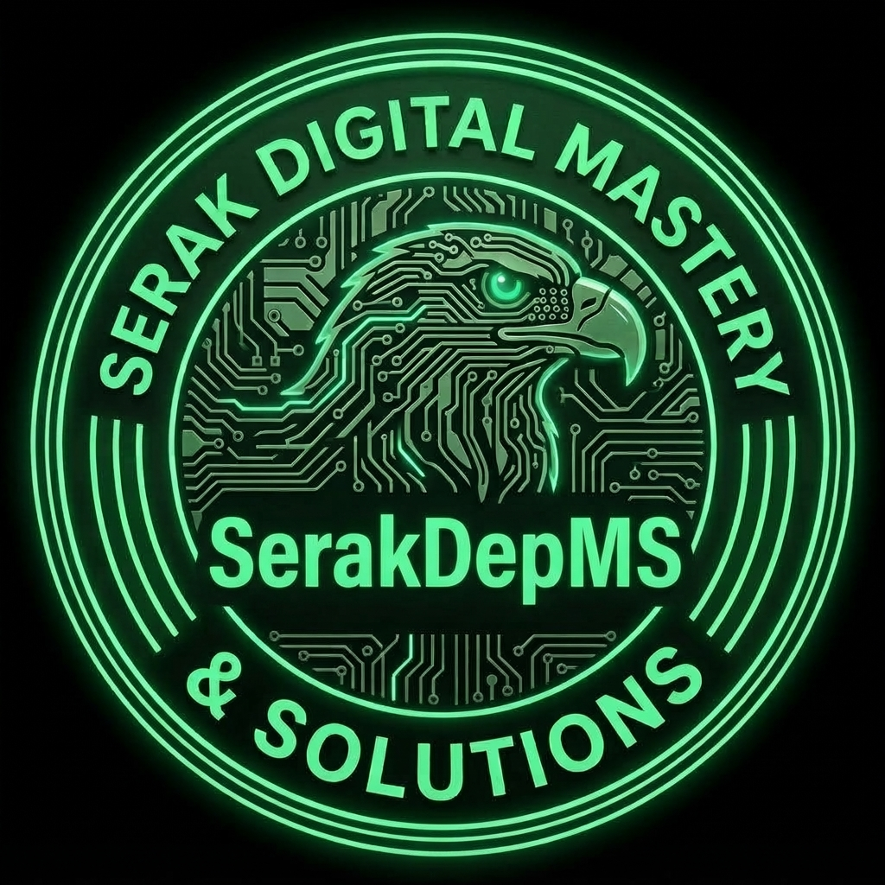

# 🎮 SerakDepMS Studios — Comunidad Gamer Oficial

**SerakDepMS Studios** es la denominación exclusiva de **SerakDepMS (Serak Digital Mastery & Solutions)** para sus comunidades Gamer y de Programación. Este proyecto representa la **Comunidad Gamer oficial Multi-Gamer** con presencia en **12 divisiones oficiales** y múltiples plataformas de juego.

---

## 🌐 Ecosistema SerakDepMS

SerakDepMS Studios forma parte de un ecosistema de **tres pilares** bajo la empresa **SerakDepMS**:

| Pilar | Denominación | Descripción |
|-------|-------------|-------------|
| 🌐 **Web & Technology** | SerakDepMS | Full Stack Architect & Cybersecurity Expert. 130+ OS mastery. |
| 🎮 **Game & Gamer Communities** | SerakDepMS Studios | 12 divisiones gaming competitivas. |
| 💻 **Programming Communities** | SerakDepMS Studios | 8 divisiones técnicas para devs. |

**Cross-links del ecosistema:**
- 🌐 [Portafolio Principal](https://serakdepms.github.io/SerakDepMS-Studios/)
- 💻 [Comunidad Devs](https://serakdepms.github.io/Serakdep-MS-Devs-Official/)
- 🎮 [Comunidad Gamer](https://serakdepms.github.io/Serakdep-MS-Clan-Official/) ← *(este proyecto)*

---

## Estatus Legal

**PROYECTO PRIVADO CON LICENCIA PROPIETARIA UNIFICADA**

- **Propiedad intelectual:** SerakDepMS — Serak Digital Mastery & Solutions
- **Autor / Fundador:** Full Stack Architect & Cybersecurity Expert
- **URL oficial:** https://serakdepms.github.io/Serakdep-MS-Clan-Official/
- **Licencia:** Propietaria — Todos los derechos reservados
- **Última actualización:** 30 de septiembre de 2026
- **Verificado en Google Search Console**

---

## Términos de Uso

### **PERMITIDO:**
- Ver el sitio web en modo de solo lectura
- Reportar errores mediante Issues de GitHub
- Sugerir mejoras mediante Discussions
- Usar el formulario de inscripción como usuario final
- Navegar por todas las páginas públicas
- Hacer Fork exclusivamente para enviar Pull Requests al repositorio oficial (eliminación obligatoria tras revisión)

### **ESTRICTAMENTE PROHIBIDO:**
- Copiar, clonar o replicar el código fuente
- Crear forks no autorizados o mantenerlos activos
- Modificar o crear trabajos derivados
- Distribuir total o parcialmente el contenido
- Uso comercial o monetización
- Hosting en otros servidores
- Extracción de funcionalidades o diseño
- Eliminar o modificar los avisos de copyright

Para términos completos, consultar el archivo [LICENSE](LICENSE) en el repositorio oficial.

---

## Las 12 Divisiones Gamer Oficiales

| # | Juego | Modalidad |
|---|---|---|
| 1 | **Roblox** | Guerras de grupos, minijuegos y torneos |
| 2 | **Minecraft** | Servidor persistente 24/7, Bedwars 4v4 y PvP |
| 3 | **Call of Duty** | Warzone, CODM Mobile y 6v6 táctico |
| 4 | **Fortnite** | Battle Royale, Zero Build y torneos |
| 5 | **Free Fire** | Escuadras 4v4 y Duelo de Escuadras |
| 6 | **Valorant** | 5v5 táctico competitivo, agentes y Premier |
| 7 | **Among Us** | Deducción social y modos custom |
| 8 | **Counter-Strike 2** | Premier 5v5, utilería táctica y scrims |
| 9 | **FC Mobile** | Ultimate Team, ligas y torneos 1v1 |
| 10 | **Clash Royale** | Ligas de guerra, donaciones y batallas 1v1 |
| 11 | **Guardian Tales** | Arena PvP, gremios cooperativos y mazmorras |
| 12 | **Blood Strike** | Battle Royale táctico en escuadras 4v4 |

---

## Cómo unirse al clan

1. **Lee el reglamento** — Aceptación obligatoria (incluye normas por división).
2. **Completa el formulario de inscripción** — Selecciona tu división principal (12 disponibles). Edad mínima: **13 años (COPPA)**. Entre 13-15 años requiere consentimiento parental verificable (Art. 8 RGPD).
3. **Espera contacto vía WhatsApp** — Para entrevista y validación.
4. **Únete a los grupos oficiales** — WhatsApp y Discord de tu división.
5. **Participa en eventos** — Gana premios y sube de rango.

---

## Sistema de Sanciones

El clan aplica un sistema progresivo de 4 niveles según la gravedad y reincidencia de las faltas:

| Nivel | Sanción | Alcance |
|:---:|---|---|
| **1** | Advertencia | Faltas leves o primeras infracciones. |
| **2** | Advertencia Formal | Reincidencia o faltas moderadas. 3 strikes = Nivel 3. |
| **3** | Expulsión Temporal | Faltas graves. Readmisión condicional. |
| **4** | Bloqueo del Ecosistema | Faltas muy graves. Permanente. |

Todas las sanciones son evaluadas por el equipo de administración de SerakDepMS Studios. El sistema está sujeto a actualizaciones para adaptarse mejor al contexto de la comunidad.

---

## Políticas Legales y Cumplimiento

El proyecto cuenta con documentación legal completa y actualizada:

- 📄 [Política de Privacidad](legal/privacidad.html) — RGPD, CCPA, LGPD
- 📄 [Términos de Servicio](legal/terminos.html) — Ley aplicable: Colombia + UE
- 🍪 [Política de Cookies](legal/cookies.html) — Inventario completo + botón de revocación
- ⚖️ [Aviso DMCA](legal/dmca.html) — Procedimiento de notificación y contra-notificación
- 🔒 [Política de Seguridad](SECURITY.md) — Reporte de vulnerabilidades y protección de datos

### Cookies implementadas

| Cookie | Finalidad | Duración | Tipo |
|---|---|:---:|---|
| `cookieConsent` | Preferencia del banner de cookies | Persistente (localStorage) | Técnica |
| `_ga` | Google Analytics 4 | 2 años | Analítica (opcional) |
| `_ga_VBV6P0W6EL` | Google Analytics 4 (session state) | 2 años | Analítica (opcional) |
| `sms_lab_project` | Proyectos de Serak | Persistente (localStorage) | Funcional |
| `sms_volume` | Volumen del reproductor de video | 6 meses (localStorage) | Funcional |

### Google Analytics 4 + Consent Mode v2

Google Analytics 4 está implementado con **Consent Mode v2** de Google. Por defecto, `analytics_storage` y `ad_storage` están en **`'denied'`** hasta que el usuario otorga consentimiento explícito mediante el banner de cookies. El script de GA4 **no se carga** antes de la aceptación.

---

## Tecnologías Utilizadas

### Frontend
- **HTML5** — Estructura semántica de las 20+ páginas.
- **CSS3** — Variables CSS, glassmorphism, animaciones, diseño responsivo y tema oscuro/claro.
- **JavaScript (Vanilla ES6+)** — Módulos ES6, interactividad, lógica de formularios, reproductor de video, chatbot, calendario, sistema de noticias y editor de código.

### Servicios y Bibliotecas
- **GitHub Pages** — Hosting del sitio estático.
- **Google Analytics 4** — Analítica anónima (solo tras consentimiento).
- **npoint.io** — Almacenamiento JSON para noticias, eventos y enciclopedia.
- **EmailJS** — Envío de correos desde formularios.
- **ipapi.co** — Geolocalización automática para formularios.
- **CodeMirror 5** — Editor de código para Serak.
- **JSHint** — Validación de JavaScript en Serak.
- **JSZip** — Descarga de proyectos en ZIP.
- **Font Awesome 6.4** — Iconografía vectorial.
- **Google Fonts** — Tipografía **Poppins** y **Fira Code**.

### SEO
- **Google Search Console** — Sitio verificado y monitoreado.
- **robots.txt** — Configuración de rastreo.
- **sitemap.xml** — URLs indexables con prioridades.
- **Meta tags de verificación** — Google Site Verification.

---

## Módulos Especiales

### Serak (`pages/laboratorio.html`)
Editor interactivo de HTML5, CSS3 y JavaScript con **+500 retos**, vista previa en tiempo real, enciclopedia de referencia y exportación de proyectos en `.zip` o `.html`.

### Terminal de Lore (`pages/media/lore.html`)
Interfaz cyberpunk con **26 capítulos históricos** navegables con atajos de teclado.

### Asistente IA (`assets/js/chatbot.js`)
Chatbot modal con **+30 categorías** de respuestas rápidas sobre reglas, eventos, divisiones y soporte.

### Reproductor de Video Custom (`assets/js/video-player.js`)
Panel avanzado con pantalla completa, control de velocidad, selector de calidad y subtítulos WebVTT.

### Contador en Tiempo Real (`assets/js/contador.js`)
Cronómetro en vivo desde el **1 de enero de 2023** (fecha de fundación).

---

## 🔗 Enlaces Oficiales

- 🌐 [Sitio Web del Clan](https://serakdepms.github.io/Serakdep-MS-Clan-Official/)
- 💬 [WhatsApp del Clan](https://wa.me/SerakDepMS)
- 🎮 [Discord Oficial](https://discord.gg/nphuM8K9aD)
- 📧 Correo oficial: `serakdepmsofficial7@gmail.com`
- 🌐 [Portafolio SerakDepMS](https://serakdepms.github.io/SerakDepMS-Studios/)
- 💻 [Comunidad Devs](https://serakdepms.github.io/Serakdep-MS-Devs-Official/)
- 🐙 [GitHub SerakDepMS](https://github.com/SerakDepMS)

---

## Aviso sobre Discord

El uso de Discord está sujeto a los **Términos de Servicio** y **Política de Privacidad de Discord Inc.**, que son independientes y autónomos de SerakDepMS Studios. SerakDepMS Studios no controla, no es responsable y no tiene acceso a los datos que Discord Inc. recopila directamente de los usuarios.

---

## Detección y Reporte de Violaciones

Este repositorio está protegido bajo la **Licencia Propietaria Unificada de SerakDepMS**. Cualquier uso no autorizado del código, diseño, marca o contenido será perseguido mediante las vías legales correspondientes.

Para reportar uso no autorizado:

1. **Correo oficial:** `serakdepmsofficial7@gmail.com`
2. **GitHub:** "Report Abuse" en el repositorio oficial
3. **Aviso DMCA:** consultar [legal/dmca.html](legal/dmca.html)

El sitio se acoge al **safe harbor** de GitHub Inc. hasta que se registre un agente propio ante la Oficina de Copyright de EE.UU.

---

## Advertencia Legal Final

> **"LA VISUALIZACIÓN DE ESTE CÓDIGO NO CONSTITUYE UNA LICENCIA PARA SU USO.**
> **CUALQUIER REPRODUCCIÓN, MODIFICACIÓN O DISTRIBUCIÓN SIN AUTORIZACIÓN ESCRITA**
> **CONSTITUYE UNA VIOLACIÓN DE DERECHOS DE AUTOR Y SERÁ PERSEGUIDA LEGALMENTE."**

Este repositorio es de **SOLA VISUALIZACIÓN**. El código se proporciona únicamente para demostración y transparencia, no para ser reutilizado, modificado o distribuido sin autorización previa y por escrito.

---

**"UNIDOS POR LA PASIÓN DEL GAMING, PROTEGIDOS POR LA LEY"**

---

© 2026 SerakDepMS. Todos los derechos reservados.
**SerakDepMS Studios** — Una división de SerakDepMS · Serak Digital Mastery & Solutions

**Última verificación legal:** 30/09/2026
**Estado:** Activo y Protegido
**Google Search Console:** Verificado
**Sitemap:** Enviado

*Nota: Este README es parte integral de los términos de licencia del proyecto.*